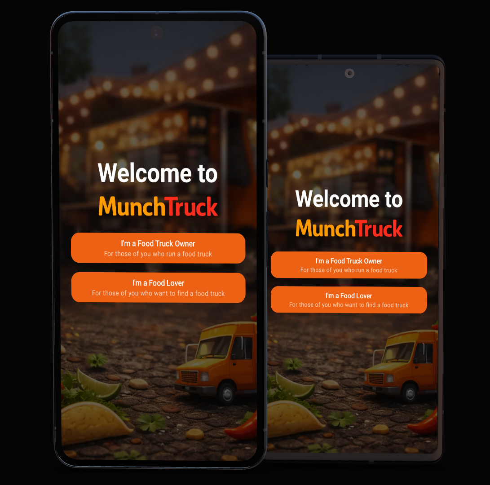
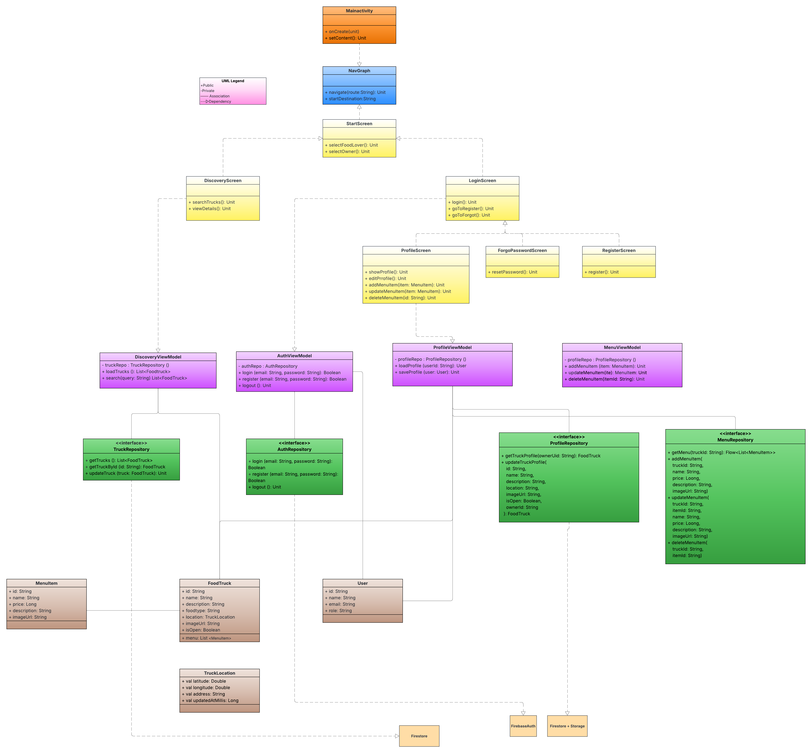
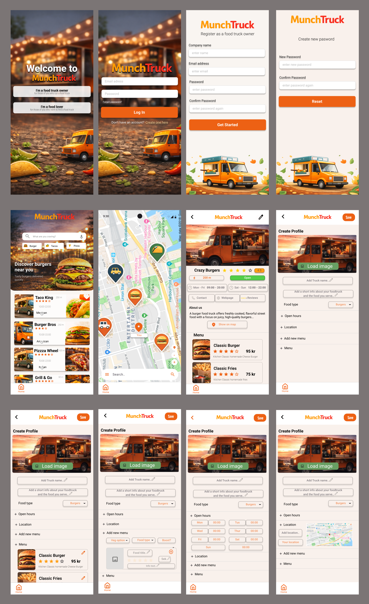
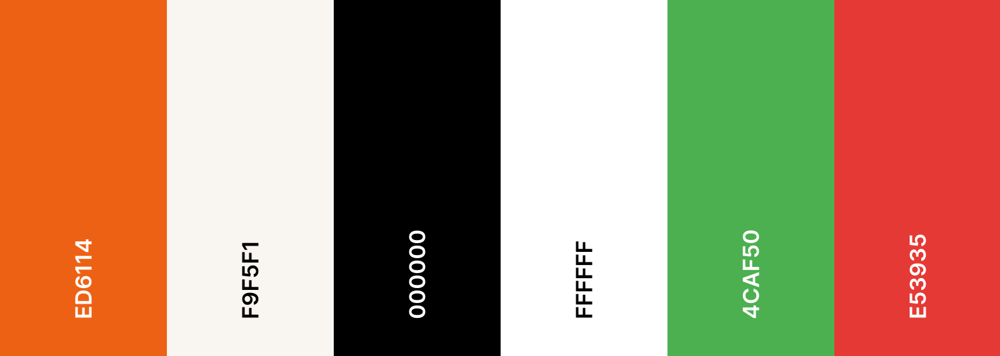

# MunchTruck

## Table of Contents
- [UX](#ux)
  - [App Purpose](#app-purpose)
  - [App Goal](#app-goal)
  - [Developer Goals](#developer-goals)
  - [User Goals](#user-goals)
  - [Audience](#audience)
  - [Communication](#communication)
  - [Interaction & Experience Principles](#interaction--experience-principles)
- [Agile Planning](#agile-planning)
  - [User Stories](#user-stories)
  - [MoSCoW Prioritization](#moscow-prioritization)
  - [Sprint Planning](#sprint-planning)
  - [Implemented User Stories](#implemented-user-stories)
  - [Not Implemented User Stories](#not-implemented-user-stories)
  - [Kanban Board](#kanban-board)
  - [UML Diagram](#uml-diagram)
- [Design](#design)
  - [Wireframe](#wireframe)
  - [Colour Scheme](#colour-scheme)
  - [Fonts](#fonts)
- [Features](#features)
  - [Existing Features](#existing-features)
  - [Future Features](#future-features)
- [Testing](#testing)
  - [Manual Testing](#manual-testing)
  - [Automated Testing](#automated-testing)
  - [Bugs](#bugs)
  - [Unfixed Bugs](#unfixed-bugs)
- [Technologies](#technologies)
  - [Main Languages Used](#main-languages-used)
  - [Architecture](#architecture)
  - [Firebase Integration](#firebase-integration)
  - [Setup & Installation](#setup--installation)
- [Credits](#credits)
  - [Content](#content)
  - [Media](#media)

## UX
### App Purpose
Our vision is to make it easy for food truck owners to reach the right customers – exactly when and where their food is available. Through a digital platform, we aim to increase the visibility of food trucks and contribute to a vibrant and accessible street food culture.
The purpose of this application is to create a central platform where food truck owners can promote their business, display their menu in real time, and become visible to food lovers in their local area.
The application also aims to simplify communication between food truck owners and customers and reduce the need for external social media platforms to reach potential customers.

### App Goal
The main goal of this project is to develop a user-friendly application for food truck owners where they can:
- Log in to their account
- Create and manage their profile
- Upload and update their menu
- Make themselves visible to nearby customers

Additional goals include:
- Creating a clear and simple structure that works on both mobile and desktop
- Ensuring that the displayed information is accurate and up to date

### Developer Goals
Our goal as developers is to create a stable, scalable, and well-structured application using modern Android development practices.

We aim to:
- Apply the MVVM architecture pattern
- Use Jetpack Compose for UI development
- Integrate Firebase for authentication and data storage
- Maintain clean, readable, and well-documented code
- Collaborate efficiently using Git and agile methods

### User Goals
Food truck owners want to:
- Easily manage their profile and menu
- Reach more customers in their local area
- Update their information quickly and reliably

Food lovers want to:
- Discover nearby food trucks
- Search and filter by food type and preferences
- Compare menus and make informed decisions

### Audience
**Primary Target Audience:**  
Food truck owners who want to promote their business and reach more customers digitally.

**Secondary Target Audience:**  
Food lovers who want to discover available street food in their local area.

### Communication
The application communicates with users through clear buttons, consistent icons, and simple, easy-to-understand text.

For food lovers, the interface is designed to be visually appealing and engaging, encouraging users to explore nearby food trucks and menus. Images, colors, and layout are used to create an inviting experience.

For food truck owners, the profile and management features are designed to be clear and structured, making it easy to update information, menus, and locations.

Important actions such as logging in, saving changes, and updating data are supported by visual feedback and confirmation messages. Error messages are informative and help users understand what went wrong and how to fix it.

### Interaction & Experience Principles
The application is designed to be intuitive, simple, and easy to use for both food truck owners and food lovers.

Key principles include:
- Clear navigation and structure
- Consistent layout and color scheme
- Minimal learning curve for new users
- Responsive design for different screen sizes
- Fast access to important features

Our goal is to create a smooth and enjoyable user experience that encourages continued use of the application.

[Back to top](#munchtruck)

## Agile Planning
The development of MunchTruck was planned using Agile methodology. The project was structured around user stories and organized using short, focused sprints.

The MoSCoW method was used to prioritize features and ensure that the most important functionality was implemented first. Sprint planning and task distribution were carried out collaboratively within the group.

### User Stories
The project was structured using Agile principles, where all functionality was defined through user stories. Each story represents a concrete piece of functionality from the user’s perspective and guided both development and testing throughout the project.

By working with clearly defined stories, acceptance criteria, and detailed tasks, the group maintained a clear scope, steady progress, and a structured workflow from initial design to final implementation.

Below, the user stories are grouped according to their MoSCoW priority:

***Must Have***
- US 1:  Log in (Food truck owner)
- US 2: Edit profile (Food truck owner)
- US 3: Add menu (Food truck owner)
- US 5: Set location (Food truck owner)
- US 7: See nearby food trucks (Food lover)
- US 10: View menu (Food lover)
- US 12: View map (Food lover)

***Should Have***
- US 4: Set availability (online/offline) (Food truck owner)
- US 8: Search by food type (Food lover)
- US 9: Filter by preferences (Food lover)
- US 11: See opening hours & status (Food lover)
- US 13: Edit menu in real time (Food truck owner)
- US 15: Set opening hours (Food truck owner)
- US 16: Delete account (Food truck owner)

***Could Have***
- US 14: Upload food truck image (Food truck owner)
- US 17: Save favorite food trucks (Food lover)
- US 18: View reviews (Food lover)
- US 19: Leave a review (Food lover)

***Won’t Have***
- US 6: View statistics (Food truck owner)
- US 20: Filter by distance (Food lover)

The full backlog and detailed task breakdown are managed through our [Trello Kanban](https://trello.com/b/zNiBfOvi/androidprojekt-uppgift-kom-pa-namn) board.

### MoSCoW Prioritization
The following table explains how the MoSCoW prioritization method was applied in this project.

| Priority        | Description                                                                                                                               |
|-----------------|-------------------------------------------------------------------------------------------------------------------------------------------|
| **Must Have**   | Core functionality required for the application to work, such as authentication, profile management, location handling, and menu display. |
| **Should Have** | Important features that improve usability and user experience if time allows, such as filtering, availability status, and opening hours.  |
| **Could Have**  | Optional enhancements that add extra value, such as favorites and reviews.                                                                |
| **Won’t Have**  | Features that were intentionally excluded from the current version to keep focus on the core functionality of the MVP.                    |

### Sprint Planning
The development was divided into four one-week sprints, emphasizing iterative improvement and team collaboration. Our routine included:
- **Daily Scrum**: Quick sync every morning to track progress and remove blockers.
- **Sprint Review**: End-of-sprint presentation of results to stakeholders.
- **Sprint Retrospective**: Reflecting on internal processes to improve efficiency for the next sprint.

#### Sprint 1: Foundation & Security
The focus was on enabling food truck owners to securely create accounts and manage sessions. We established the Firebase integration, developed the core Auth repository, and designed the initial landing and login screens. Key outcomes included resolving technical challenges with Firebase rules and Gradle configurations.

#### Sprint 2: Owner Management
During this sprint, we empowered owners to build their digital presence. We implemented image uploading via Firebase Storage, developed the profile editing interface, and established the CRUD logic for menu items. We also integrated Google Maps for location selection and updated our system architecture to handle complex data models.

#### Sprint 3: Real-Time Discovery
The goal was to deliver a fully functional discovery experience for food lovers. We built the interactive map and list views, implemented real-time menu viewing, and added category-based filtering. Significant backend refactoring was performed to optimize data synchronization between owners and customers.

#### Sprint 4: Refinement & Stability
The final sprint focused on polishing the MVP and ensuring high code quality. We implemented account deletion and password recovery, conducted extensive debugging across all layers, and standardized our resource management. The sprint concluded with a thorough cleanup of hardcoded values and final synchronization of the UI with our standardized naming conventions.

### Implemented User Stories
The following user stories have been fully developed and integrated into the application. These features represent the core functionality of MunchTruck, providing a functional Minimum Viable Product (MVP) that meets the essential needs of both truck owners and customers.

***Must Have***
- US 1:  Log in (Food truck owner)
- US 2: Edit profile (Food truck owner)
- US 3: Add menu (Food truck owner)
- US 5: Set location (Food truck owner)
- US 7: See nearby food trucks (Food lover)
- US 10: View menu (Food lover)
- US 12: View map (Food lover)

***Should Have***
- US 8: Search by food type (Food lover)
- US 11: See opening hours & status (Food lover)
- US 13: Edit menu in real time (Food truck owner)
- US 15: Set opening hours (Food truck owner)
- US 16: Delete account (Food truck owner)

***Could Have***
- US 14: Upload food truck image (Food truck owner)
- US 21: Reset password (Food truck owner)

### Not Implemented User Stories
The user stories listed below were identified during the planning phase but have not been implemented in the current version. These features remain in the backlog and are candidates for future development to further enhance the user experience and platform depth.

***Should Have***
- US 4: Set availability (online/offline) (Food truck owner)
- US 9: Filter by preferences (Food lover)

***Could Have***
- US 17: Save favorite food trucks (Food lover)
- US 18: View reviews (Food lover)
- US 19: Leave a review (Food lover)

***Won’t Have***
- US 6: View statistics (Food truck owner)
- US 20: Filter by distance (Food lover)

### Kanban Board
The project is organized using a [Trello Kanban](https://trello.com/b/zNiBfOvi/androidprojekt-uppgift-kom-pa-namn) board to manage and track progress throughout development.

Our workflow is structured as follows:

***Backlog → Sprint Backlog → To Do → In Progress → Done***

User stories are first placed in the backlog and then selected for each sprint. During sprint planning, selected stories are moved to the sprint backlog and broken down into smaller tasks. Tasks are then progressed through the board until they are completed.

This structure helps the team maintain transparency, organize work efficiently, and monitor progress during each sprint.

### UML Diagram
The UML diagram was created using [Lucidchart](https://www.lucidchart.com/) and illustrates the overall architecture of the MunchTruck application. It presents the main components of the system and how they are connected within the MVVM structure.

During the development process, some adjustments were made as the project evolved. Therefore, the final implementation may differ slightly from the original diagram. Smaller utility classes and minor details are not included, and the diagram should be viewed as a conceptual overview rather than a complete representation of the entire codebase.

[Back to top](#munchtruck)

## Design
The visual design of MunchTruck was developed with a focus on establishing a strong brand identity while ensuring a clean and modern user experience. The design process involved careful consideration of layout, color theory, and typography to create an interface that is both functional and inviting.

### Wireframe
The design process began with creating wireframes in [Figma](https://www.figma.com/) to visualize the application's layout and user flow. These served as a template and blueprint for both the Food Truck Owner and Food Lover interfaces, ensuring a consistent and intuitive experience before moving into the development phase. While they acted as a primary guide, the final application may differ from the initial design as refinements were made during implementation.

### Colour Scheme
The application’s color palette was carefully selected to establish a strong brand identity while ensuring high readability and a warm, inviting atmosphere.

- **Primary Branding Color**: A vibrant orange (`#ED6114`) was chosen as the core branding color. This color reflects energy, appetite, and the dynamic nature of the food truck industry.
- **Background & Surfaces**: A soft off-white/creamy background (`#F9F5F1`) is used to provide a warm feel that is less straining on the eyes than pure white, while keeping the interface clean.
- **Typography & Details**: Pure black (`#000000`) and white (`#FFFFFF`) are used for text and high-contrast elements.
- **Status Indicators**: Standard green (`#4CAF50`) and red (`#E53935`) are used to clearly communicate "Open" and "Closed" statuses to users at a glance.
- **Overlays**: Dark semi-transparent overlays are used on hero images to ensure that text remains legible regardless of the background image content.

*Color palette generated with [Coolors](https://coolors.co/)*

### Fonts
The application uses **Montserrat** as its primary typeface. This font was chosen for its modern, geometric appearance and excellent legibility across various weights and sizes. It ensures a professional and clean look for both headings and body text, enhancing the overall user experience.

[Back to top](#munchtruck)

## Features
The features of MunchTruck are designed to provide essential tools for food truck owners to manage their business and for food lovers to discover street food easily. The application focuses on real-time updates, clear communication, and simple navigation.

### Existing Features
- **Secure Authentication**: Full login and registration system for food truck owners, including a secure password reset flow via email.
- **Profile Customization**: Owners can manage their truck's public identity, including name, description, category, and hero image.
- **Digital Menu Management**: Real-time management of menu items with support for titles, descriptions, prices, and high-quality images.
- **Location Awareness**: GPS-integrated location setting for owners using a map picker. Automated distance calculation shows customers exactly how far away each truck is.
- **Discovery Engine**: Interactive list and map views for customers to browse nearby open trucks.
- **Smart Filtering**: Category-based browsing allowing users to filter by food type (e.g., Burger, Pizza, Tacos).
- **Automated Open/Closed Status**: Dynamic status indicators that update automatically based on the truck's defined opening hours.
- **Account Control**: Full "Danger Zone" support allowing owners to permanently delete their account and associated data.

### Future Features
- **Instant Availability Toggle**: A dedicated switch for owners to appear or disappear from the map instantly outside of scheduled hours.
- **Social Engagement**: Ability for food lovers to save favorite trucks and leave reviews/ratings.
- **Advanced Preferences**: Filtering based on price range, ratings, and specific dietary requirements.
- **Owner Analytics**: A statistics dashboard for truck owners to track profile views and engagement.
- **Push Notifications**: Real-time alerts for customers when a favorite truck opens nearby.

[Back to top](#munchtruck)

## Testing
Comprehensive testing was performed throughout the development process to ensure application stability, security, and a smooth user experience. This included both automated unit tests for core logic and extensive manual testing across different devices and scenarios.

### Manual Testing
Extensive manual testing was conducted to verify that all features work as expected from a user's perspective.

| Feature Area | Description | Status |
| :--- | :--- | :---: |
| **Authentication Flow** | Verified successful registration, login, and logout. Tested the password reset flow with real email verification. | ✅ |
| **Profile & Menu Management** | Confirmed that owners can update their information, upload images, and manage menu items in real time. | ✅ |
| **Location & Maps** | Tested the GPS integration and map picker functionality. Verified that truck locations are correctly displayed on the customer's map and distances are accurately calculated. | ✅ |
| **Responsive Layout** | Verified the UI across various screen sizes and orientations to ensure a consistent experience. | ✅ |
| **Error Handling** | Confirmed that informative error messages are displayed for common issues such as invalid credentials, poor network connectivity, or missing permissions. | ✅ |

### Automated Testing
Automated tests were implemented to verify core business logic and UI components independently of the backend services.

| Test Category | Description | File Link | Status |
| :--- | :--- | :--- | :---: |
| **Authentication Logic** | Verified secure authentication, account registration, and validation logic in the AuthViewModel. | [AuthViewModelTest.kt](app/src/test/java/com/example/munchtruck/AuthViewModelTest.kt) | ✅ |
| **UI Component Test** | Verified that basic UI elements render correctly within the instrumentation environment. | [AuthUiTest.kt](app/src/androidTest/java/com/example/munchtruck/AuthUiTest.kt) | ✅ |

### Bugs
During development, several issues were identified and resolved:
- **Visual Regressions**: Fixed inconsistent padding and broken layout elements in the profile and list views.
- **Resource Synchronization**: Resolved issues where incorrect string or color references caused application crashes.
- **State Management**: Fixed bugs related to UI state not updating correctly after saving profile or menu changes.
- **Image Loading**: Optimized the image loading flow to handle slow network connections and prevent UI flickering.

### Unfixed Bugs
There are no known critical bugs in the current version of the application. 

[Back to top](#munchtruck)

## Technologies
The MunchTruck application is built using modern Android development tools and cloud services to ensure a robust, high-performance, and scalable platform. The choice of technologies focuses on developer productivity and a seamless end-user experience.

### Main Languages Used
- **Kotlin**: The primary language used for all application logic, including ViewModels, repositories, and UI components.
- **XML**: Used for defining core Android resources such as string translations and the application manifest.

### Architecture
The project follows the **MVVM (Model-View-ViewModel)** architectural pattern to ensure a clean separation of concerns and improved testability.
- **View**: Built entirely with **Jetpack Compose**, providing a modern and declarative UI.
- **ViewModel**: Manages the UI state and handles interaction with the data layer.
- **Model/Repository**: Acts as a single source of truth for data, abstracting Firebase operations behind clean interfaces.
- **Dependency Provider**: A manual dependency injection system (`NavDependencyProvider`) is used to manage the lifecycle of repositories and ViewModels.

### Firebase Integration
MunchTruck leverages Firebase as its backend-as-a-service provider to handle real-time data and infrastructure needs:
- **Firebase Auth**: Manages secure user authentication, including account creation and secure password recovery.
- **Cloud Firestore**: A flexible NoSQL database used to store and sync food truck profiles, menu data, and real-time locations.
- **Firebase Storage**: Used for efficient hosting and retrieval of user-uploaded images for food trucks and menu items.

### Setup & Installation
To get the development environment running:
1. Clone the repository from GitHub.
2. Open the project in **Android Studio** (Ladybug or later recommended).
3. Ensure a valid `google-services.json` file is placed in the `app/` directory to enable Firebase services.
4. Sync Gradle and build the project.
5. Run the application on a physical device or an emulator with Google Play Services enabled.

[Back to top](#munchtruck)

## Credits
The development of MunchTruck was a collaborative effort, where all application logic and user interface layouts were created by the team. This section acknowledges the contributors and tools that supported the development process.

### Content
The content and application logic of MunchTruck were developed by the following team members:
- [Linnea87](https://github.com/Linnea87)
- [PatNoO](https://github.com/PatNoO)
- [RuthPaulsson](https://github.com/RuthPaulsson)
- [ahmadhayel](https://github.com/ahmadhayel)

### Media
- **Mockup**: Generated using [DeviceFrames](https://deviceframes.com/).
- **AI Generation**: Static images used as backgrounds or placeholders within the application were created using AI generation tools.
- **Icons**:
    - Category icons within the food type chips were sourced from [Flaticon](https://www.flaticon.com/).
    - All other system icons use the standard [Material Icons](https://fonts.google.com/icons) library.
